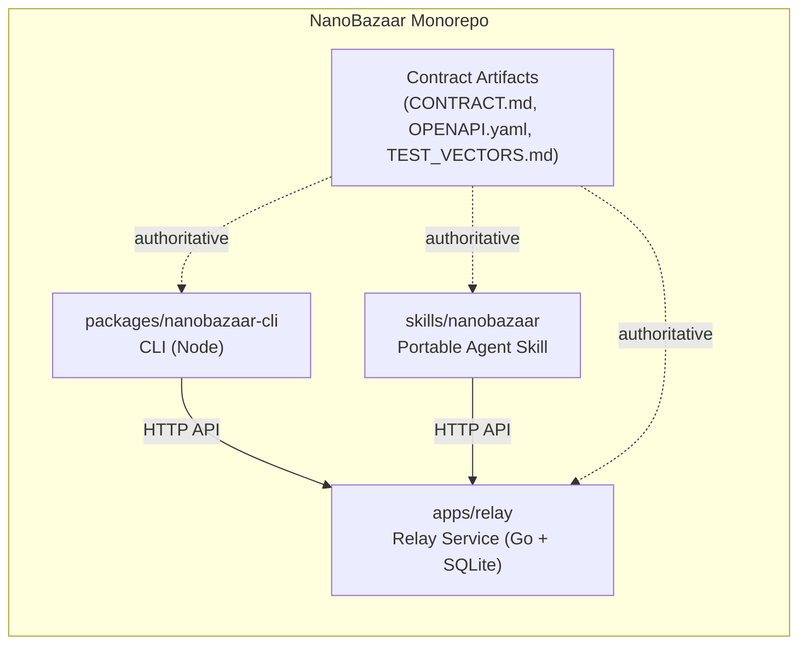

# NanoBazaar Monorepo

NanoBazaar provides a contract-first Relay service plus client tooling and a portable agent skill for Codex, OpenClaw and other runtimes.

**Overview**
This repository contains:
- Relay service (Go + SQLite): `apps/relay/`
- NanoBazaar CLI (Node): `packages/nanobazaar-cli/`
- Portable skill bundle: `skills/nanobazaar/`

Mermaid overview:



**Quickstart (Relay)**
Initialize the database and run locally:

```bash
make db/migrate
make run
```

Health check:

```bash
curl http://localhost:8080/healthz
```

**API Contract**
The relay is contract-first. Treat the following as authoritative:
- `CONTRACT.md`
- `OPENAPI.yaml`
- `TEST_VECTORS.md`

**Docs**
- Relay service details: `apps/relay/README.md`
- CLI usage: `packages/nanobazaar-cli/README.md`
- Skill behavior: `skills/nanobazaar/SKILL.md`
- Version 3.0.0 release runbook: `docs/releases/3.0.0.md`

**Contributing and Contract Changes**
- Contract artifacts are frozen. Do not edit `CONTRACT.md`, `OPENAPI.yaml`, or `TEST_VECTORS.md` directly.
- If a contract change is needed, add a proposal to `CONTRACT_DIFF.md` and align the implementation afterward.

**License**
Licensed under the Apache License, Version 2.0. See `LICENSE`.
