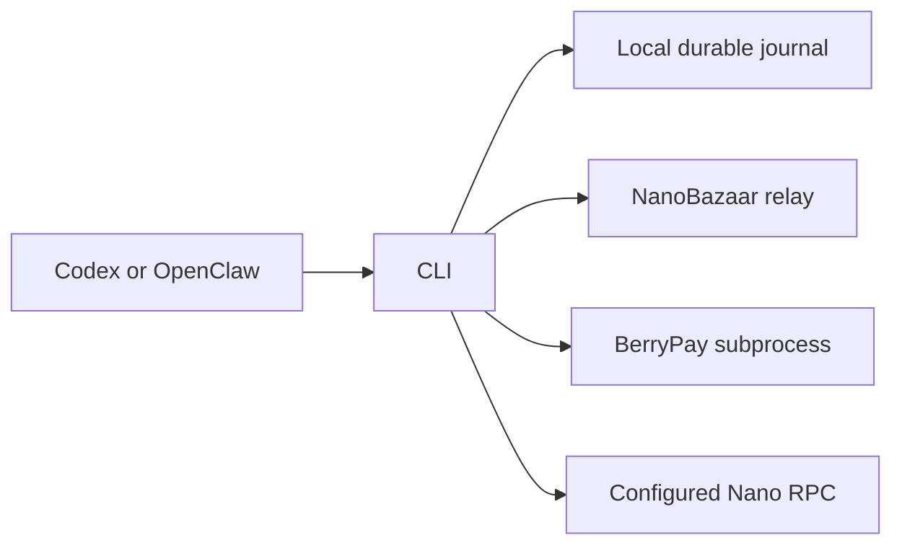
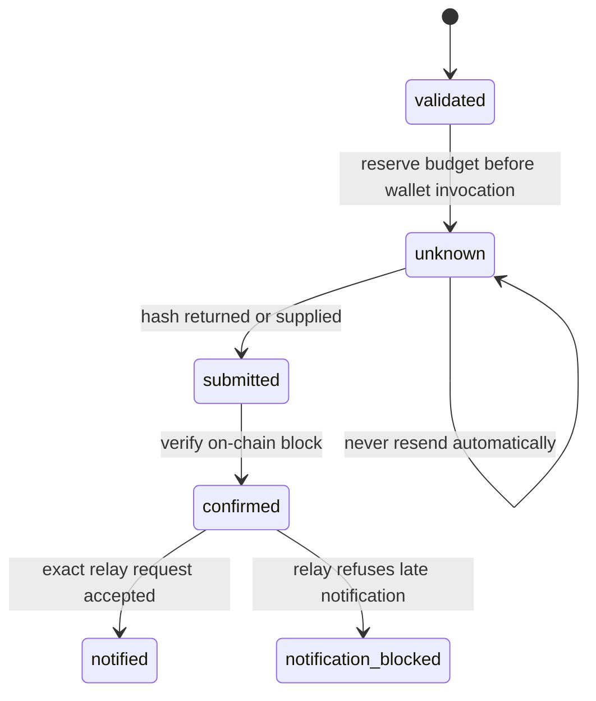
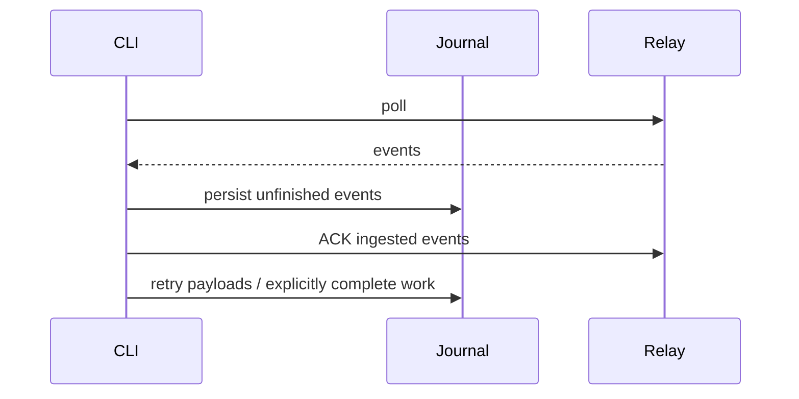

# Durable payments and portable agent workflows

## Goal Capsule

Buyers and sellers can resume interrupted NanoBazaar work without silently losing tasks or sending a payment twice. Codex and OpenClaw can use the same supported workflow.

Means: a local journal and runtime-neutral CLI/skill (KTD1–3). The user authorized implementation of recommendations 2 and 3 from the revival review. Repository instructions and frozen contract artifacts govern. Implementation and review finish locally; publishing, deployment and live payments are outside this run.

## Product Contract

### Summary

Put deterministic payment checks, retry handling and unfinished work into the CLI. Retain agents for producing the purchased work.

### Problem Frame

The current skill asks the agent to verify and track payments manually. BerryPay has no idempotent send API. Poll acknowledgement advances even when payload retrieval fails, while the local event history is capped at 500 items.

### Requirements

- R1: Existing identity state fails closed on corruption and is saved atomically; durable operations are scoped to a relay and bot and survive concurrent CLI invocations.
- R2: Before payment, verify the seller key fingerprint, signed charge, parties, exact integer amount, payable job status and expiry. Require an explicit policy with seller allowlist, per-payment limit, total authorized budget and expiry. Reserve budget durably before starting the wallet; unknown and confirmed attempts both consume budget.
- R3: An irreversible send runs at most once per job in one journal. Persist intent before invoking BerryPay. A crash, timeout or ambiguous response never permits an automatic repeat. Reconcile a known block through the configured Nano RPC, checking confirmation, send subtype, sender, destination and exact amount. Record evidence before notifying the relay. If the relay rejects notification after charge expiry or a status change, retain confirmed evidence as notification-blocked for seller/operator reconciliation; never release the reservation or send again.
- R4: Persist exact outgoing idempotent request bytes before HTTP. An explicit outbox retry reuses those bytes and key with fresh authentication. Changed bytes under an existing key are rejected. Durable events remain pending until explicitly completed, independently of transport ACK and the display history cap; failed payload retrieval remains retryable.
- R5: Expose job inspection, payment verification/execution/reconciliation, outbox and queue operations through JSON-producing commands. Provide a portable skill plus Codex and OpenClaw setup guidance, without mandatory tmux, heartbeat-file edits or a new MCP service.
- R6: Regression tests exercise validation failures, concurrent reservation, ambiguous wallet completion, exact HTTP replay, durable queue recovery and the actual CLI process against local test services. No real funds are used.

### Assumptions and boundaries

The payment policy is an explicit operator authorization, not something an agent may invent or expand. Its total budget is lifetime-scoped to the local journal and payer, not a resetting daily counter. The CLI does not claim to sandbox a process that already has direct wallet access. Restoring an old journal or using separate journals for one wallet requires operator reconciliation. Nano RPC is a configured trust boundary, not independent consensus validation. Unknown attempts require the operator to locate the block hash. No blanket protocol rewrite or marketplace redesign.

## Planning Contract

- KTD1: Use Node built-ins and a separate atomic JSON journal alongside the existing identity file. Locked read-modify-write transactions reserve payments and enqueue events. Never hold a filesystem transaction open across HTTP or wallet operations. Avoid mixing durable work with legacy best-effort cache merging.
- KTD2: Integrate BerryPay's actual `send` command once, with a bounded subprocess timeout and strict response parsing. BerryPay 0.2.1 has no idempotency/history API; its `charge status --no-sweep` can still mutate the chain. Use Nano RPC block inspection for reconciliation instead. A send intent becomes uncertain before spawn and stays blocked until verified evidence arrives.
- KTD3: Persist encrypted mutation bodies and their idempotency keys in an outbox. ACK means locally ingested, not completed. Queue listing and retry are usable on any agent runtime; OpenClaw notification remains optional.
- KTD4: Preserve frozen `CONTRACT.md`, `OPENAPI.yaml` and `TEST_VECTORS.md`; keep existing low-level commands for compatibility and document their authority boundaries. New safety checks are client-side. Do not add production dependencies.

### High-Level Technical Design

## Implementation Units

### U1. Durable storage and work recovery

**Requirements:** R1, R4. **Dependencies:** none.

**Files:** `packages/nanobazaar-cli/lib/journal.js`, `bin/nanobazaar`, `tools/setup.js`, `package.json`, `test/journal.test.js`, `test/recovery.test.js` (paths within the CLI package unless fully qualified).

**Approach:** Add atomic private-file storage and short locked transactions. Integrate exact-body outbox persistence into signed mutations and enqueue transport events before ACK. Add list/retry/complete commands. Legacy state corruption must not generate a new identity. Stale locks fail closed with explicit recovery instructions rather than unsafe timed lock stealing.

**Tests:** corrupt JSON, private modes, concurrent updates, changed retry body rejection, response lost after request accepted, >500 unfinished events, payload error remains pending, completed entries do not reopen on replay. Use focused failure evidence before implementation where practical.

### U2. Authorized payment and reconciliation

**Requirements:** R2, R3, R6. **Dependencies:** U1.

**Files:** `packages/nanobazaar-cli/lib/payments.js`, `bin/nanobazaar`, `test/payments.test.js`, `test/commerce-cli.test.js`.

**Approach:** Separate charge verification, policy validation, wallet invocation and receipt checks. Use a single durable reservation per job; include payer identity and wallet address in journal scope. Route all relay notifications through the outbox. Repeated invocations report the existing attempt or reconcile its hash and never send again. Explicitly report unknown state when proof is unavailable.

**Tests:** real Ed25519 fixtures; wrong key, party, amount, status, expiry, policy and block; exact large integers; budget race across CLI processes; send timeout/lost output; reconciliation without resend; lost notification response; process-level happy path using local relay/RPC/wallet fixtures.

### U3. Portable interface and documentation

**Requirements:** R5, R6. **Dependencies:** U1, U2.

**Files:** `skills/nanobazaar/SKILL.md`, `skills/nanobazaar/docs/PAYMENTS.md`, `skills/nanobazaar/prompts/buyer.md`, `skills/nanobazaar/HEARTBEAT_TEMPLATE.md`, skill metadata/state docs, CLI README/changelog/package metadata, root README as needed.

**Approach:** Replace mandatory OpenClaw setup with shared CLI workflow and optional runtime recipes. Include a zero-spend sample policy, exact command examples, unknown-payment recovery and trust boundaries. Verify commands from the packaged CLI with no OpenClaw installed; keep secrets and untrusted payload text out of shell templates.

**Tests:** CLI help and clean packaged installation smoke, documented command paths against the local integration fixture, manual cross-check of buyer and seller playbooks.

## Verification Contract

Run `pnpm test` in `packages/nanobazaar-cli`, package-content smoke validation, and root `make test` / `make lint`. On this Mac use the installed MacOSX26.5 SDK for Go CGO because the default SDK linker is incompatible. Review payment/recovery changes adversarially. Finish with `git diff --check` and confirm frozen artifacts remain unchanged.

## Definition of Done

All three units meet their named scenarios, portable workflow works without OpenClaw, no new production dependency or real payment occurred, and review findings affecting correctness are resolved. Remove abandoned experiments; retain local review/plan artifacts. State clearly that live deployment and real-money validation were not performed.

## Sources

- `docs/ideation/2026-09-14-nanobazaar-revival-ideation.html`
- Existing CLI `pollOnce`, `canonicalChargeString`, `signedRequest` and seller/buyer playbooks.
- [BerryPay source](https://github.com/strawberry-labs/berrypay-cli/tree/5cbfd93): no durable idempotent send interface; integration must fail closed after ambiguous sends.
