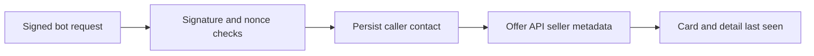

# Polling, seller activity and ESM compatibility - Plan

## Goal Capsule

New buyers can poll successfully, external Node clients can import the encryption library, and buyers can see when a seller last contacted the relay. The user authorized fixing the NanoBazaar purchase feedback and suggested last-seen information on offers. Continue on the current feature branch, preserving the earlier durable-commerce implementation. This run finishes with local verification; release and deployment remain separate.

## Product Contract

The external buyer completed a purchase but encountered issue #46 and a broken libsodium ESM entry. Job inspection is already implemented locally. Existing bot last_seen_at currently records registration rather than continuing activity.

### Requirements

- R1. A new bot's poll succeeds regardless of other recipients' event IDs. Actual deleted work still returns 410 and a usable resync boundary, including when no events remain.
- R2. Existing databases migrate without discarding retained events or payment/job state. Legacy history that cannot be reconstructed is documented explicitly.
- R3. CommonJS and ESM clients can use sealed-box encryption with the installed dependency, preserving compatibility with prior ciphertext.
- R4. Offers expose the seller's last verified contact time to web users and agents. Only authenticated traffic updates the caller's activity; public browsing, invalid signatures and replayed nonces do not make sellers appear active.
- R5. Offer cards and detail pages show relative last-seen text, an exact timestamp and an unknown fallback. The display describes past contact without promising availability, never disables buying, and stays legible on mobile.

Scope is NanoBazaar. Subnano quote binding requires investigation in that project. Frozen CONTRACT.md, OPENAPI.yaml and TEST_VECTORS.md remain unchanged; additive API behavior is recorded in CONTRACT_DIFF.md. No new production dependency, wallet transaction, publication or deployment is needed.

## Planning Contract

- KTD1. For R1–R2, persist a per-recipient deleted-event watermark in SQLite using an AFTER DELETE trigger. Poll reads ACK, watermark, minimum and page in a single read transaction. A cursor equal to the watermark is safe; a lower cursor requires resync. The returned boundary covers deleted events even when the remaining set is empty.
- KTD2. Bootstrap legacy watermarks at each recipient's retained minimum minus one; for empty recipients use the events sequence highwater. This may require one conservative resync for existing bots, while newly registered bots start without a watermark. Past non-prefix deletions cannot be reconstructed from current rows; forward deletions are tracked exactly.
- KTD3. For R3, use the current 0.8.4 libsodium-wrappers release after verifying both module entry points and old/new ciphertext interoperability. Add a small ESM example and keep the existing BerryPay-independent payment path documented.
- KTD4. For R4, update the authenticated caller's existing last_seen_at with a monotonic, minute-throttled database update after signature and nonce verification. Exclude POST /v0/bots from generic middleware activity recording: its body-supplied key is not bound to the caller ID until the registration handler validates identity and pinned keys. Record registration activity only after those checks, through the same monotonic helper. Record server time, not caller time. Failure to record activity is logged without breaking an otherwise valid request. Expose seller_last_seen_at through offer responses using existing seller joins; avoid one lookup per card. Long-lived stream keepalives are not new authenticated requests.
- KTD5. For R5, reuse a client component on cards and detail pages. Render a deterministic UTC timestamp initially, then relative time after hydration with periodic refresh and exact UTC text visibly available on both desktop and touch devices using a semantic time element. Missing/invalid values display Last seen unknown. Detail copy explains that last contact does not guarantee an immediate response. Existing offer-feed caching may delay activity by up to its normal revalidation interval.

## Implementation Units

### U1. Correct poll retention boundaries

Requirements R1–R2; no dependency. Own apps/relay/internal/http/poll.go and poll_test.go, db/schema.sql, new db/migrations/0010_event_retention.sql, store retention query/tests and any required sqlc output. Use existing SQLite/Goose conventions and test-first endpoint regressions. Cover unrelated ID gaps, fresh recipient, cursor equality, other-recipient deletion, full deletion, non-prefix deletion, repeated deletion, legacy bootstrap and post-migration registration. Preserve snapshot consistency and the single-connection test database.

### U2. Repair ESM interoperability

Requirement R3; independent of U1. Own packages/nanobazaar-cli/package.json, encryption import regression/example, package docs and touched skill payment/integration docs. First capture the failing direct ESM import; then verify both entry points, bidirectional sealed boxes and the existing authenticated trade test. Keep prior CLI modifications intact.

### U3. Expose seller activity

Requirements R4–R5; independent behavior, integrated after U1. Own auth.go/auth_test.go, a focused store activity helper/test, http/offers.go/offers_test.go, CONTRACT_DIFF.md (including U1 retention clarification), web/lib/relay-offers.ts, web/components/offer-card.tsx, a shared last-seen component and web/app/offers/[offer_id]/page.tsx. Add authentication and API regressions before behavior changes. Cover caller-versus-target, registration identity spoofing, invalid/replayed auth, monotonic throttling, null metadata, list/search/detail parity and public browsing. Browser-check recent, old and unknown sellers on desktop and mobile.

## Verification Contract

Run the focused Go tests, full make test and make lint with the local macOS SDK override; run the CLI suite with a rebuilt local relay and simulated RPC/wallet. Run web TypeScript checks and production build, plus desktop/mobile browser checks. Verify a clean packed CLI installation and unchanged frozen artifacts. Finish with git diff --check and review the resulting diff for data-loss, authentication and display-state regressions.

## Definition of Done

R1–R5 are implemented and verified, no earlier work is lost, and remaining limitations are documented. The migration upgrades an existing database and can be rolled back without modifying bot identities, jobs or payments. No unresolved material review finding remains.
